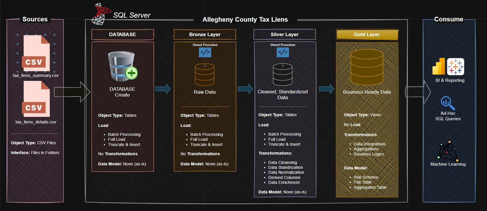

# Allegheny County Tax Liens Analytics Project

Welcome to the Allegheny County Tax Liens Analytics Project repository! 🚀
This project demonstrates the design and implementation of a SQL-based data pipeline and analytical model using a public dataset of property tax liens from Allegheny County.

The goal of the project is to ingest raw CSV data, transform and clean it, and build an analytical data model that enables meaningful insights about tax lien records, municipalities, and outstanding property tax debt.

- The project follows modern Data Engineering practices, including ETL processes, layered data architecture, and SQL-based analytics.
- This project was created as part of my data engineering / data analytics portfolio and follows industry best practices used in modern data platforms.

---
## 🏗️ Data Architecture

The architecture follows the **Medallion Architecture pattern** with three layers:

Bronze → Silver → Gold



1. **Bronze Layer**: Stores the raw data exactly as it is ingested from the original CSV datasets. This layer acts as the source of truth, preserving the original structure and data for traceability.

2. **Silver Layer**: Contains cleaned, standardized, and validated data. Column names are normalized, inconsistent values are handled, and the dataset is prepared for analytics.

3. **Gold Layer**: Provides analytics-ready datasets designed for reporting, dashboards, and data analysis. This layer includes aggregated metrics and optimized views.

---
# 📖 Project Overview

This project uses the Allegheny County Tax Liens public dataset, which contains records of tax liens filed against properties due to unpaid taxes.
The dataset includes information such as:
- Property identification numbers
- Filing dates of tax liens
- Municipality and ward information
- Tax amounts and outstanding debts
- Entities assigned to the liens
Using this dataset, the project builds a data warehouse-style analytical structure that allows users to explore trends in tax debt, municipal activity, and property-level liabilities.
The project demonstrates how raw public data can be transformed into a structured analytical system using SQL Server.

---

# 🎯 Skills Demonstrated

This project highlights several Data Engineering and Analytics skills, including:

- SQL Data Modeling
- ETL Pipeline Development
- Data Cleaning and Transformation
- Medallion Architecture (Bronze / Silver / Gold)
- SQL Window Functions
- Data Aggregation and Analytical Queries
- Database Design
- Data Documentation and Data Dictionary creation
- Git and GitHub for version control

---
## 🛠️ Important Links & Tools:

- **[Datasets](datasets/):** Access to the project dataset (csv files).
- **[SQL Server Express](https://www.microsoft.com/en-us/sql-server/sql-server-downloads):** Lightweight server for hosting your SQL database.
- **[SQL Server Management Studio (SSMS)](https://learn.microsoft.com/en-us/sql/ssms/download-sql-server-management-studio-ssms?view=sql-server-ver16):** GUI for managing and interacting with databases.
- **[Git Repository](https://github.com/):** Set up a GitHub account and repository to manage, version, and collaborate on your code efficiently.
- **[DrawIO](https://www.drawio.com/):** Design data architecture, models, flows, and diagrams.


---

## 🚀 Project Requirements

### Building a Tax Liens Data Warehouse (Data Analytics)

#### Objective
Design and implement a data pipeline and analytical data model that transforms raw tax lien records into a structured dataset suitable for analysis and reporting.

#### Specifications
- **Data Ingestion**: Load raw CSV datasets into SQL Server using BULK INSERT.
- **Data Transformation**: Clean, standardize, and normalize raw data into structured tables.
- **Data Modeling**: Build an analytical model using the Medallion Architecture.
- **Analytical Queries**: Create SQL views and queries to analyze tax lien activity.
- **Documentation**: Provide clear documentation of the data pipeline and database schema.

---

# 📊 Analytics & Reporting

The analytical model enables exploration of patterns within the tax lien dataset.
## Property Insights
- Properties with the highest outstanding tax debt
- Number of active liens per property
- Historical tax lien activity
## Municipal Analysis
- Municipalities with the highest lien activity
- Distribution of tax debt by municipality
- Ward-level tax lien trends
## Financial Trends
- Total tax debt across properties
- Lien filing trends over time
- Distribution of lien amounts

---

## 📂 Repository Structure
```
data-warehouse-project/
│
├── datasets/                           # Raw datasets used for the Allegheny County tax liens project
│   ├── tax_liens_details.csv
│   └── tax_liens_summary.csv 
│
├── docs/                               # Project documentation and architecture details
│   └── ...
│
├── scripts/                            # SQL scripts for ETL and transformations
│   ├── init_database.sql               # Scripts for create AlleghenyTaxLiens database
│   ├── load_silver.sql                 # Scripts for load silver schema tables
│   ├── load_gold.sql                   # Scripts for load gold schema viewer
│   └── gold_querrys.sql                # Scripts for gold Query's
│
├── README.md                           # Project overview and instructions
├── LICENSE                             # License information for the repository
└── .gitignore
```
---


## 🛡️ License

This project is licensed under the [MIT License](LICENSE). You are free to use, modify, and share this project with proper attribution.

# 👨‍💻 About Me

Hi! I'm **Leandro Gallo**, a **Systems Engineering student** from Argentina with a strong interest in:

- Data Engineering
- Data Analytics
- Backend Development
- Cybersecurity
- Software Development

I enjoy building **data pipelines, automation tools, and data-driven systems**, and I am currently developing projects to strengthen my skills in **data architecture, SQL development, and analytics**.

This repository is part of my **technical portfolio**, where I showcase projects related to:

- Data Warehousing
- ETL Pipelines
- Data Modeling
- Analytics

---

# 🔗 Connect With Me

📧 Email  
leandrogallo698@gmail.com


